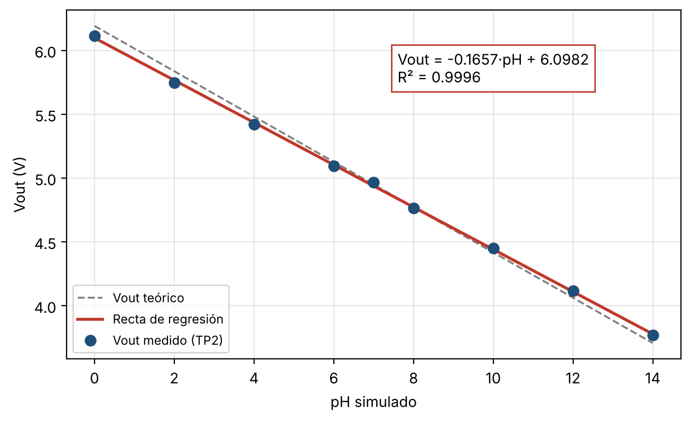

# Etapa de ganancia y calibración — Laboratorio N.° 2

Instrumentación Biomédica III — Escuela Profesional de Ingeniería Biomédica, Universidad Nacional Mayor de San Marcos (UNMSM).
Docente: María Elisia Armas Alvarado.

## Descripción

Este repositorio contiene el código, los datos y las fotografías del Laboratorio N.° 2, cuyo objetivo es diseñar, implementar y calibrar una etapa de amplificación no inversora que expanda la señal bufferizada de un electrodo de pH simulado, de modo que aproveche mejor la resolución del sistema de medida.

Un ESP32 simula la respuesta de un electrodo de pH mediante su DAC en GPIO25. La señal pasa por un buffer seguidor (op-amp 1 del TL084, punto TP1) y luego por un amplificador no inversor con ganancia teórica Av = 3 (op-amp 2 del TL084, punto TP2). Finalmente, se construye una curva de calibración Vout vs. pH mediante regresión lineal.

## Contenido

| Carpeta / archivo | Descripción |
|---|---|
| `codigo/generador_ph.ino` | Programa del ESP32 que lee el pH por el Monitor Serie, valida el rango 0–14 y genera el voltaje simulado en GPIO25 |
| `datos/` | Datos medidos en las Etapas A, B y C (CSV), resultados de la regresión y curva de calibración |
| `fotos/` | Fotografías del montaje y de las mediciones, organizadas por etapa |

## Materiales

TL084N, tres resistencias de 10 kΩ (R1 = 10 kΩ y Rf = 20 kΩ formada por dos en serie), placa ESP32 DevKit V1 con cable USB, protoboard, cables jumper, fuente dual Siglent SPD3303C configurada en ±12 V, osciloscopio GW Instek GDS-1072A-U y multímetro Fluke 179.

## Cómo reproducir el experimento

1. Abrir `codigo/generador_ph.ino` en el Arduino IDE, seleccionar la placa *ESP32 Dev Module* en *Herramientas > Placa* y cargar el programa.
2. Abrir el Monitor Serie a 115200 baudios con la opción *Nueva línea* y escribir un valor de pH entre 0 y 14. El programa muestra el voltaje ideal, el código del DAC y el voltaje generado en GPIO25.
3. **Etapa A (buffer):** verificar la fuente en ±12 V y alimentar el TL084 por los pines 4 (V+) y 11 (V−). Conectar los op-amps 3 y 4 como seguidores con la entrada no inversora a GND. Armar el seguidor en el op-amp 1 (GPIO25 al pin 3; pines 1 y 2 unidos) y medir el voltaje en TP1 (pin 1).
4. **Etapa B (amplificador):** conectar TP1 al pin 5 del op-amp 2, R1 = 10 kΩ entre el pin 6 y GND, y Rf = 20 kΩ entre el pin 7 y el pin 6. Medir Vout en TP2 (pin 7) para pH 0 y pH 14 y calcular Av = ΔVout / ΔVin.
5. **Etapa C (calibración):** medir Vout en TP2 para pH 0, 2, 4, 6, 7, 8, 10, 12 y 14, y ajustar una recta Vout = a·pH + b por mínimos cuadrados.

Las tierras de la fuente, el ESP32 y los instrumentos deben estar unidas.

## Ecuaciones utilizadas

Voltaje generado por el ESP32 (pendiente de Nernst a 25 °C):

Vin = 1,65 V − 0,05916 V/pH × (pH − 7)

Ganancia del amplificador no inversor:

Av = 1 + Rf / R1 = 1 + 20 kΩ / 10 kΩ = 3

Valores teóricos de la recta de calibración: a = −Av·S = −0,1775 V/pH y b = Av·(Vbias + 7·S) = 6,192 V.

Como el DAC del ESP32 es de 8 bits (pasos de unos 12,9 mV), el voltaje generado difiere ligeramente del teórico; ambos valores se incluyen en `datos/etapaC_calibracion.csv`.

## Resultados principales

| Parámetro | Valor |
|---|---|
| Ganancia experimental | ≈ 2,8 (dentro de ±10 % de Av = 3) |
| Ecuación de calibración | Vout = −0,1657·pH + 6,0982 |
| R² | 0,9996 |
| Sensibilidad experimental | 0,1657 V/pH (error de 6,65 % respecto a 0,1775 V/pH) |

## Integrantes

- Cava León, Elmer Alexis — 23190437
- Diaz Melendez, Sofia Marleny — 23190439
- Enriquez Villalobos, Cristhian Anghelo — 23190440
- Huarcaya Vasquez, Alice Gabriela — 23190121
